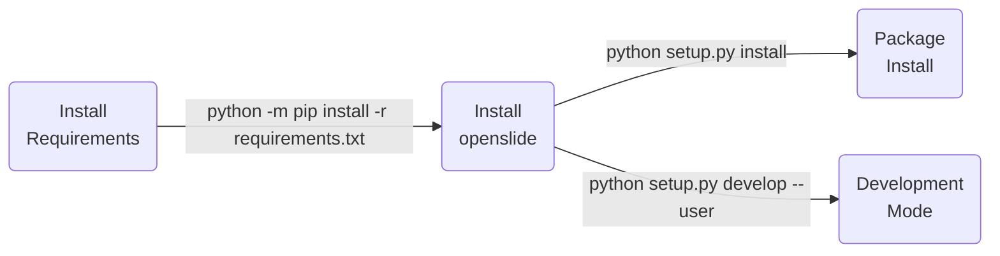

# OpenSlide

| **Windows CI** | **MacOS CI** | **Linux CI** | **Python CI** |
|:--------------:|:------------:|:------------:|:-------------:|
| [](https://github.com/Nico-Curti/openslide/actions/workflows/windows.yml) | [](https://github.com/Nico-Curti/openslide/actions/workflows/macos.yml) | [](https://github.com/Nico-Curti/openslide/actions/workflows/linux.yml) | [](https://github.com/Nico-Curti/openslide/actions/workflows/python.yml) |

**C supported compilers:**


**Python version supported:**


Carnegie Mellon University and others

https://openslide.org/

-----------------------------------

## What is this?

This library reads whole slide image files (also known as virtual slides).
It provides a consistent and simple API for reading files from multiple
vendors.

## What is the license?

This code is licensed under the GNU LGPL version 2.1, not any later version.
See the file lgpl-2.1.txt for the text of the license.

## Requirements

This library requires zlib, libpng, libjpeg, libtiff, OpenJPEG 1.x or >= 2.1,
GDK-PixBuf, libxml2, SQLite >= 3.6.20, cairo >= 1.2, and glib >= 2.16.
Leica and Ventana support require libtiff >= 4.

If you want to run the test suite, you will need PyYAML, python-requests,
xdelta3, cjpeg and djpeg (from libjpeg), a Git checkout of OpenSlide,
at least one installed font, and > 120 GB of disk space.  Valgrind mode
requires Valgrind, plus debug symbols for library dependencies (particularly
glib2) and Fontconfig.  Profile mode requires Valgrind.  Coverage mode
requires gcov and Doxygen.

## Features

The library can read Aperio, Hamamatsu, Leica, MIRAX, Sakura, Trestle,
and Ventana formats, as well as TIFF files that conform to a simple
convention. (InterScope files tend to be readable as this generic TIFF.)

More information about formats is here:
https://openslide.org/formats/

An openslide_t object can be used concurrently from multiple threads
without locking. (But you must lock or otherwise use memory barriers
when passing the object between threads.)

## Properties

The library exposes certain properties as string key-value pairs for
a given virtual slide. (These are accessed by way of the
"openslide_get_property_names" and "openslide_get_property_value" calls.)

These properties are generally uninterpreted data gathered from the
on-disk files. New properties can be added over time in subsequent releases
of OpenSlide. A list of some properties can be found at:
https://openslide.org/properties/

OpenSlide itself creates these properties (for now):

* openslide.background-color
```
   The background color of the slide, given as an RGB hex triplet.
   This property is not always present.
```

* openslide.bounds-height
```
   The height of the rectangle bounding the non-empty region of the slide.
   This property is not always present.
```

* openslide.bounds-width
```
   The width of the rectangle bounding the non-empty region of the slide.
   This property is not always present.
```

* openslide.bounds-x
```
   The X coordinate of the rectangle bounding the non-empty region of the
   slide. This property is not always present.
```

* openslide.bounds-y
```
   The Y coordinate of the rectangle bounding the non-empty region of the
   slide. This property is not always present.
```

* openslide.comment
```
   A free-form text comment.
```

* openslide.mpp-x
```
   Microns per pixel in the X dimension of level 0. May not be present or
   accurate.
```

* openslide.mpp-y
```
   Microns per pixel in the Y dimension of level 0. May not be present or
   accurate.
```

* openslide.objective-power
```
   Magnification power of the objective. Often inaccurate; sometimes missing.
```

* openslide.quickhash-1
```
   A non-cryptographic hash of a subset of the slide data. It can be used
   to uniquely identify a particular virtual slide, but cannot be used
   to detect file corruption or modification.
```

* openslide.vendor
```
   The name of the vendor backend.
```

## Other Documentation

The definitive API reference is in openslide.h. For an HTML version, see
doc/html/openslide_8h.html in this distribution.

Additional documentation is available from the OpenSlide website:
https://openslide.org/

The design and implementation of the library are described in a published
technical note:

* OpenSlide
 ```
 A Vendor-Neutral Software Foundation for Digital Pathology
 Adam Goode, Benjamin Gilbert, Jan Harkes, Drazen Jukic, M. Satyanarayanan
 Journal of Pathology Informatics 2013, 4:27

 http://download.openslide.org/docs/JPatholInform_2013_4_1_27_119005.pdf
```

There is also an older technical report:

* CMU-CS-08-136
```
 A Vendor-Neutral Library and Viewer for Whole-Slide Images
 Adam Goode, M. Satyanarayanan

 http://reports-archive.adm.cs.cmu.edu/anon/2008/abstracts/08-136.html
 http://reports-archive.adm.cs.cmu.edu/anon/2008/CMU-CS-08-136.pdf
```

**Cite**

```BibTeX
@article{10.4103/2153-3539.119005,
   author = {Goode, Adam. and Gilbert, Benjamin. and Harkes, Jan. and Jukic, Drazen. and Satyanarayanan, Mahadev.},
   title = {{OpenSlide: A vendor-neutral software foundation for digital pathology}},
   journal = {Journal of Pathology Informatics},
   volume = {4},
   number = {1},
   pages = {27},
   doi = {10.4103/2153-3539.119005},
   year = {2013},
   abstract = {Although widely touted as a replacement for glass slides and microscopes in pathology, digital slides present major challenges in data storage, transmission, processing and interoperability. Since no universal data format is in widespread use for these images today, each vendor defines its own proprietary data formats, analysis tools, viewers and software libraries. This creates issues not only for pathologists, but also for interoperability. In this paper, we present the design and implementation of OpenSlide<i>,</i> a vendor-neutral C library for reading and manipulating digital slides of diverse vendor formats. The library is extensible and easily interfaced to various programming languages. An application written to the OpenSlide interface can transparently handle multiple vendor formats. OpenSlide is in use today by many academic and industrial organizations world-wide, including many research sites in the United States that are funded by the National Institutes of Health.},
   URL = {https://www.jpathinformatics.org/article.asp?issn=2153-3539;year=2013;volume=4;issue=1;spage=27;epage=27;aulast=Goode;t=6},
   eprint = {https://www.jpathinformatics.org/article.asp?issn=2153-3539;year=2013;volume=4;issue=1;spage=27;epage=27;aulast=Goode;t=6}
   }
```

```BibTeX
@article{TechnicalReport,
   author = {Goode, Adam and Satyanarayanan, Mahadev},
   year = {2007},
   month = {11},
   pages = {},
   title = {A Vendor-Neutral Library and Viewer for Whole-Slide Images},
   journal = {Computer Science Department, Carnegie Mellon University, Technical Report CMU-CS-08-136}
   }
```

## Acknowledgements

OpenSlide has been supported by the National Institutes of Health and
the Clinical and Translational Science Institute at the University of
Pittsburgh.

## How to build? (master version)

./configure
make
make install

(If building from the Git repository, you will first need to install
autoconf, automake, libtool, and pkg-config and run "autoreconf -i".)

Good luck!

## How to build? (forked version)

We recommend to use `CMake` for the installation since it is the most automated way to reach your needs.
First of all make sure you have a sufficient version of `CMake` installed (3.10.2 minimum version required).
If you are working on a machine without root privileges and you need to upgrade your `CMake` version a valid solution to overcome your problems is provided [here](https://github.com/Nico-Curti/Shut).

### Prerequisites

The dependency of the C `openslide` package are:

* libtiff-dev
* glib2.0
* libcairo2-dev
* libgdk-pixbuf2.0-dev
* libopenjp2-7
* libsqlite3-dev
* libxml2-dev
* zlib1g-dev
* libpng-dev

You can easily install all the dependencies with the following commands:

<details><summary><b>Linux</b></summary>
<p>

```bash
sudo apt install -y libtiff-dev glib2.0 libcairo2-dev libgdk-pixbuf2.0-dev libopenjp2-7 libsqlite3-dev libxml2-dev zlib1g-dev libpng-dev
# Install OpenJPEG library from source since bionic distribution doesn't support it
sudo apt install -y liblcms2-dev libz-dev
# dependencies of OpenJPEG library
sudo apt install -y webp zstd

git clone https://github.com/uclouvain/openjpeg
cd openjpeg
cp path/to/openslide/cmake/modules/* cmake/
mkdir build && cd build
sudo cmake .. -DCMAKE_BUILD_TYPE=Release
sudo make install
cd .. && cd ..
```

| :warning: WARNING |
|:------------------|
| The older versions of Ubuntu don't support the `glib2.0` library installation, but you can substitute the installation with `libglib2.0-dev`. |

| :warning: WARNING |
|:------------------|
| The latest versions of Ubuntu don't need to manually install the `OpenJPEG` library since it is already included into the `libopenjp2-7` distribution. |

</p>
</details>

<details><summary><b>MacOS</b></summary>
<p>

```bash
brew install -y libtiff-dev libglib2.0-dev libcairo2-dev libgdk-pixbuf2.0-dev libjpeg-dev libsqlite3-dev libxml2-dev zlib1g-dev libpng-dev
brew install -y liblcms2-dev libz-dev
# dependencies of OpenJPEG library
brew install -y webp zstd
# Install OpenJPEG library from source since bionic distribution doesn't support it
git clone https://github.com/uclouvain/openjpeg
cd openjpeg
cp path/to/openslide/cmake/modules/* cmake/
mkdir build && cd build
sudo cmake .. -DCMAKE_BUILD_TYPE=Release
sudo make install
cd .. && cd ..
```

| :warning: WARNING |
|:------------------|
| The older versions of Ubuntu don't support the `glib2.0` library installation, but you can substitute the installation with `libglib2.0-dev`. |

| :warning: WARNING |
|:------------------|
| The latest versions of Ubuntu don't need to manually install the `OpenJPEG` library since it is already included into the `libopenjp2-7` distribution. |

</p>
</details>

<details><summary><b>Windows (7+)</b></summary>
<p>

```PowerShell
git clone https://github.com/Microsoft/vcpkg.git
cd vcpkg
.\bootstrap-vcpkg.bat
.\vcpkg integrate install
.\vcpkg install tiff:x64-windows glib:x64-windows cairo:x64-windows gdk-pixbuf:x64-windows openjpeg:x64-windows sqlite3:x64-windows libxml2:x64-windows zlib:x64-windows libpng:x64-windows
```

| :warning: WARNING |
|:------------------|
| The Python installation of the library requires the manual setting of the `VCPKG_ROOT` environment variable. Please set this variable to the vcpkg root dir before the installation of the package. |

| :warning: WARNING |
|:------------------|
| Despite the manual installation of the full set of libraries you could get some `Missing library` errors: in these cases (probably) you are working with an old version of `CMake` (we are still working on the minimum cmake version required), thus we suggest to update your CMake and retry the building. |

| :warning: WARNING |
|:------------------|
| There is a known issue related to the `libpixman-v0.38` package which could affect the correct execution of some `Openslide` commands (ref. [here](https://github.com/openslide/openslide/issues/291#issuecomment-722935212)). The only available workaround is to downgrade or update your current installed version avoiding this particular version of the library! |

| :warning: WARNING |
|:------------------|
| Pay attention to work with the latest version of vcpkg package! |

</p>
</details>

The only dependencies of the Python `openslide` package are:

* cython>=0.29
* numpy>=1.15

and you can easy install them with `python -m pip install -r requirements.txt`.

### Installation

#### C library

With a valid `CMake` version installed first of all clone the project as:

```bash
git clone https://github.com/Nico-Curti/openslide
cd openslide
```

The you can build the `openslide` package with

```bash
mkdir -p build
cd build && cmake .. && cmake --build . --target install
```

`Openslide` could be built with CMake and Make or with the *build* scripts in the project.
Example:

|              |  **Linux**    |  **MacOS**    |  **Windows**  |
|:------------:|:--------------|:--------------|:--------------|
| **Script**   | `./build.sh`  | `./build.sh`  | `./build.ps1` |

The `CMake` command line can be customized according to the following parameters:

* `-DPYTHON_Openslide:BOOL` : Enable/Disable the build of Python wrap of the library via Cython (see next section for Python requirements)
* `-DBUILD_TEST:BOOL` : Enable/Disable the build of test scripts
* `-DBUILD_DOCS:BOOL` : Enable/Disable the build of docs using Doxygen
* `-DBUILD_JAVA:BOOL` : Enable/Disable the build of Java wrap
* `-DBUILD_JS:BOOL` : Enable/Disable the build of Javascript wrap

#### Python package

If you have already built the `openslide` `C` library the installation is performed faster and the `Cython` wrap was already built using the `-DPYTHON_Openslide` definition.
Otherwise the full list of dependencies is build.

In both cases the installation steps are:



| :warning: WARNING |
|:------------------|
| The installation of the `Python` modules requires the `CMake` support and all the listed above libraries.<br>If you are working under *Window OS* we require the usage of `VCPKG` for the installation of the libraries and a precise configuration of the environment variables.<br>In particular you need to set the variables `VCPKG_ROOT=/path/to/vcpkg/rootdir/` and `VCPKG_DEFAULT_TRIPLET=x64-windows`.<br>A full working example of OS configuration can be found in the CI actions of the project, available [here](https://github.com/Nico-Curti/openslide/blob/main/.github/workflows/) |

### Supported format

This forked version aims to extend the portability of Openslide library to multiple OS and multiple WSI formats.
The complete list of supported formats is


|  **Scanner**                                                  |     **Format**             |    **Brightfield**          |    **Fluorescence**   |
|:-------------------------------------------------------------:|:--------------------------:|:---------------------------:|:---------------------:|
| [Aperio](https://openslide.org/formats/aperio/)               |     (.svs, .tif)           |         :+1:                |                       |
| :star: [Tiff](https://openslide.org/formats/generic-tiff/)    |     (.tif)                 |         :+1:                |         :+1:          |
| [Hamamatsu](https://openslide.org/formats/hamamatsu/)         |     (.vms, .vmu, .ndpi)    |         :+1:                |                       |
| [Leica](https://openslide.org/formats/leica/)                 |     (.scn)                 |         :+1:                |                       |
| [Mirax](https://openslide.org/formats/mirax/)                 |     (.mrxs)                |         :+1:                |                       |
| :star: Olympus                                                |     (.vsi, .ets)           |         :+1:                |         :+1:          |
| [Philips](https://openslide.org/formats/philips/)             |     (.tiff)                |         :+1:                |                       |
| [Sakura](https://openslide.org/formats/sakura/)               |     (.svslide)             |         :+1:                |                       |
| [Trestle](https://openslide.org/formats/trestle/)             |     (.tif)                 |         :+1:                |                       |
| [Ventana](https://openslide.org/formats/ventana/)             |     (.bif, .tif)           |         :+1:                |                       |

| :triangular_flag_on_post: Note |
|:-------------------------------|
| In the Olympus format we extend also the Tiff support to the OME-Tiff format :muscle: |

| :triangular_flag_on_post: Note |
|:-------------------------------|
| In the Tiff format we extend also the Tiff support to the JP2K compression :muscle: |

### FAQ

* **How can I install the library via `VCPKG` dependency manager?**

The `openslide` library is not yet supported via `vcpkg` (I have not submitted any PR yet).
However, in the [`cmake`](https://github.com/Nico-Curti/openslide/blob/master/cmake) folder you can find a complete directory-tree named `vcpkg`.
You can simply copy&paste the entire `vcpkg` folder over the original (cloned [here](https://github.com/microsoft/vcpkg)) project to manage the entire installation of the library *also* via vcpkg.

| :triangular_flag_on_post: Note |
|:-------------------------------|
| Since no releases have been published yet, the [`portfile`](https://github.com/Nico-Curti/openslide/blob/master/cmake/ports/openslide/portfile.cmake) is not complete and you need to manually set the `REF` and `SHA512` variables! |
